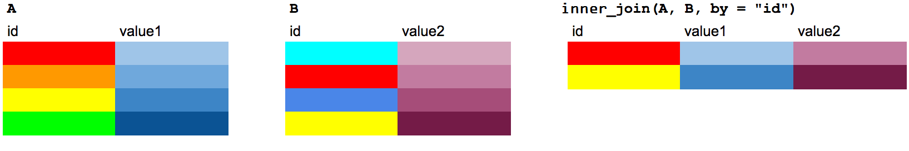
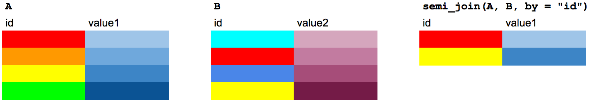
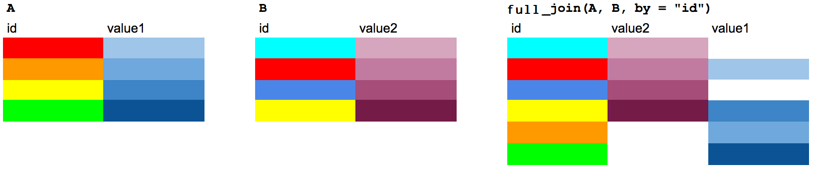
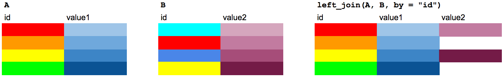
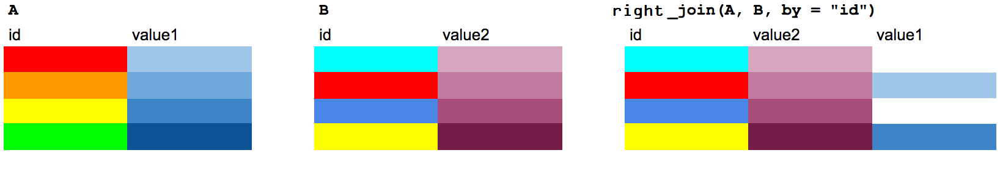

layout: true

<div class="my-footer"><span>

<a href="https://www.meetup.com/pt-BR/R-Ladies-Vitoria">Meetup</a> | 
<a href="http://instagram.com/rladiesvix">Instagram</a> |
<a href="https://github.com/rladies/meetup-presentations_vitoria">Github</a> 


</span></div> 

```{r setup, include=FALSE}
knitr::opts_chunk$set(echo = FALSE, fig.align = "center", message = FALSE, 
                      warning = FALSE, comment = "  #>", collapse = T)

library(knitr)
```

---

### Na última aula

- R-Ladies

- Introdução ao R

- R básico

### O que veremos hoje

- Importação de dados

- Tratamento de dados

- Medidas descritivas

- Exercicios

---
class: middle

# Importação de dados

## Extensão .txt ou .csv

Opção com o pacote **readr**.

```{r, eval=FALSE,include=TRUE,echo=TRUE,error=TRUE}
library(readr) #pacote readr
dados_csv <- read_csv(file = "dados1.csv")
dados_txt <- read_delim(file = "caminho-para-o-arquivo/dados1.txt", delim = " ")
```

<!-- O argumento file= representa o caminho onde o arquivo está alocado. Se o arquivo estiver no diretório de trabalho, não precisa especificar o caminho até o arquivo. O argumento delim= indica qual caracter separa cada coluna no arquivo de texto. -->
 
Outra opção: 
<!-- para leitura de arquivo .txt é usar a função read.table que já está salva na base, ou seja, não é necessário instalar pacote.  -->

```{r, eval=FALSE,include=TRUE,echo=TRUE,error=TRUE}
dados_txt2 <- read.table(file="dados1.txt",header=T)
```

<!-- O argumento header indica se a primeira linha do arquivo consta o nome das variáveis. Se for T (TRUE), a primeira linha é indicada como nome das variáveis. O default é header=F.  -->

Vale ressaltar que para cada função read_, existe uma respectiva função write_ para salvar o arquivo no formato de interesse. Como exemplo, queremos salvar a base de dados cars. 

```{r, eval=FALSE,include=TRUE,echo=TRUE,error=TRUE}
write_csv(x = mtcars, path = "cars.csv")
write_delim(x = mtcars, delim = " ", path = "cars.txt"))
```

---
class: middle

## Arquivos em Excel

O pacote **readxl** pode ser utilizado para leiturade arquivos do Excel, como .xls e xlsx.

```{r, eval=FALSE,include=TRUE,echo=TRUE,error=TRUE}
library(readxl)
dados_excel <- read_xls(path = "dados1.xls") #Leitura do arquivo .xls
dados_excelx <- read_xlsx(path = "dados1.xlsx") #Leitura do arquivo .xlsx
```

Uma maneira mais simples é a utilização da função read_excel(), pois ela auto detecta a extensão do arquivo.
```{r, eval=FALSE,include=TRUE,echo=TRUE,error=TRUE}
library(readxl)
dados_excel1 <- read_excel(path = "dados1.xls")
dados_excelx1 <- read_excel(path = "dados1.xlsx")
```


## Arquivos de outros softwares

<!-- Para ler dados salvos em extensão de outros softwares: SPSS, STATA e SAS: pacote haven.  -->

```{r, eval=FALSE,include=TRUE,echo=TRUE,error=TRUE}
library(haven)
dados_stata <- read_stata("dados1.dta")
dados_spss <- read_spss("dados1.sav")
dados_sas <- read_sas("dados1.sas7bdat")  
```

<!-- Outra opção de pacote para importação de dados de outros softwares é o foreign. Além do SAS, STAT e SPSS, ele também lê dados do Octave, Minitab e Epi Info.  -->


---
class: middle

## Tratamento de dados

A análise de consistência consiste em realizar uma primeira análise dos dados com o intuito de encontrar inconsistências. 
* boas práticas para nome das variáveis. 
* identificar erros de digitação;
* indivíduos imputados mais de uma vez na planilha de dados de maneira errada; 
* identificar casos missings e avaliar se a observação está ausente de maneira correta ou não;
* identificar as categorias de variáveis qualitativas.

Consideramos como exemplo os dados fictícios de $n=30$ gestações gemelares. Vamos considerar duas bases de dados. Na primeira, chamada de "Base_CTG_caracterizacao" estão contidas as informações de caracterização das gestantes e gestações. 

Para importar a base de dados: 
```{r, eval=TRUE,include=TRUE,echo=TRUE,error=TRUE}
library(readxl)
dados <- read_excel(path = "database/petro.xls",na="NA", sheet = "Refino") # Selecionando a aba
dados
```

---
class: middle

##Exercício

Na base em excel, retire os NA's, deixando em branco, e rode o seguinte comando:

```{r, eval=FALSE,include=TRUE,echo=TRUE,error=TRUE}
library(readxl)
dados <- read_excel(path = "database/petro.xls", na="NA", sheet = "Refino")
```
O default do missing é o espaço em branco. Acesse o help em ?read_excel e veja na = "".  

---

### Nome das variáveis

Utilizaremos as funções tidyverse e janitor para a arrumação da base de dados. 


```{r, eval=TRUE,include=TRUE,echo=TRUE,error=TRUE,message=FALSE}
library(tidyverse)
library(janitor)

names(dados)
dados <- clean_names(dados) # a função clean_names() para primeiro ajuste dos nomes das variaveis
names(dados)
```

---
class: middle

### Linhas e colunas vazias 
 Na base de dados em questão, não há linhas vazias, como pode ser visto na saída abaixo. 

```{r, eval=TRUE,include=TRUE,echo=TRUE,error=TRUE}
dados <- remove_empty(dados,"rows")
```

Propositalmente, inclui a coluna "oi" vazia para podermos eliminá-la com o comando abaixo: 
```{r, eval=TRUE,include=TRUE,echo=TRUE,error=TRUE}
dados <- remove_empty(dados,"cols")
names(dados)
```

---
class: middle

### Identificação de casos duplicados

<!-- Uma boa prática consiste em identificar casos duplicados, isto é, identificar se há casos erroneamente repetidos. No exemplo, a variável chave é id, em que cada indivíduo distinto apresenta um id distinto.  Para identificar casos duplicados pela variável chave "id", usamos a função get_dupes do pacote janitor.  -->

```{r, eval=TRUE,include=TRUE,echo=TRUE,error=TRUE}
get_dupes(dados, amostra)
```
<!-- No exemplo, note que os IDs=2, 11, 17 e 23 aparecem dois casos cada, o que não está correto para essa aplicação.  -->
<!-- Para eliminar linhas duplicadas identificadas, usamos a função distinct do pacote dplyr. No objeto dados1 salvamos os dados sem os casos duplicados.  -->

---
class: middle

```{r, eval=TRUE,include=TRUE,echo=TRUE,error=TRUE,message=FALSE}
library(dplyr)
dados1 <-  distinct(dados,amostra, .keep_all = TRUE)
dados1
```
<!-- Ao chamar os dados1,  apenas as dez primeiras linhas são impressas na tela e as colunas que não couberem na largura do console serão omitidas. Vale ressaltar que também são apresentadas a dimensão da tabela (no exemplo, 30X12) e as classes de cada coluna. -->

---
class: middle

### Identificar tipo e classe de todas as variáveis da base
Para identificar a classe de todas as variáveis que o R está interpretando, usamos a função str(.).  

```{r, eval=TRUE,include=TRUE,echo=TRUE,error=TRUE}
# Ver a estrutura dos dados
str(dados1)
```

---
class: middle

```{r, eval=TRUE,include=TRUE,echo=TRUE,error=TRUE}
dados1$data_inicio  <- as.Date(dados1$data_inicio)

dados1$data_fim <- as.Date(dados1$data_fim)
str(dados1)
```

---

class: middle


### Identificar tipo e classe de todas as variáveis da base

Utilizamos a função as.Date(.) porque queríamos mudar para tipo data. Abaixo está a lista das funções para mudança de tipo.

* **as.character** -  converte para variável texto.

* **as.numeric** - converte para variável número.

* **as.factor** - converte para variável categórica.

* **as.integer** - converte para variável inteiro.

* **as.Date** - converte para variável data.

* **as.POSIXct** - converte para variável data e hora completa. 

---

class:  middle

### Identificar erros
Para variáveis qualitativas: tabela de frequências da variável campo. 

```{r, eval=TRUE,include=TRUE,echo=TRUE,error=TRUE}
#do pacote janitor
tabyl(dados1,campo) 
```

Para lidar com variáveis de texto, vamos utilizar a função str_to_lower do pacote stringr.

```{r, eval=TRUE,include=TRUE,echo=TRUE,error=TRUE}

library(stringr)
dados1$campo <- str_to_lower(dados1$campo)
tabyl(dados1,campo)
```

---
class: middle

### Transformação de variáveis quantitativas

É possível criar novas variáveis quantitativas a partir de outras variáveis. A criação de novas variáveis pode ajudar a capturar relações complexas entre os dados e fornecer insights adicionais. 
Uma nova variável que pode ser criada é a razão entre saturados e aromáticos, que pode fornecer informações sobre a composição do petróleo.

```{r, eval=TRUE,include=TRUE,echo=TRUE,error=TRUE}
dados1 <- mutate(dados1, indice_saturados_aromaticos = dados1$saturados / dados1$aromaticos)

summary(dados1$indice_saturados_aromaticos)
```

---
class: middle

### Exercicio

Crie uma variável que calcula a razão entre resinas e asfaltenos, indicando a estabilidade coloidal do petróleo.

---

class: middle

### Discretizar dados
Dependendo da natureza dos dados e das análises que vão ser realizadas, é necessário discretizar(categorizar) os dados.
Nesse casos, iremos discretizar o ponto de fluidez

```{r, eval=TRUE,include=TRUE,echo=TRUE,error=TRUE}

dados1$ponto_de_fluidez_categoria <- cut(
  dados1$ponto_de_fluidez,
  breaks = c(-Inf, 0, 10, Inf),  # Definindo os limites das categorias
  labels = c("Baixo", "Medio", "Alto"),
  right = TRUE  # Inclui o valor de limite superior na categoria
)

tabyl(dados1, ponto_de_fluidez_categoria)
```
---
### Discretizar dados

No R tem um pacote só para manipular fatores: o **forcats** (for categorial variables). 

Primeiro, precisamos informar o R que a variável é fator com níveis, com o comando as.factor(.).

```{r, eval=TRUE,include=TRUE,echo=TRUE,error=TRUE}
library(forcats)

dados1$ponto_de_fluidez_categoria <- fct_recode(dados1$ponto_de_fluidez_categoria,
                                            "Baixo" = "Baixo",
                                            "Medio" = "Medio",
                                            "Alto" = "Alto")
fct_count(dados1$ponto_de_fluidez_categoria)
```
---

class: middle

### Exercício

O TAN (Número de Acidez Total) é uma medida da acidez de um petróleo ou produto petroquímico, a interpretação dos níveis de acidez pode variar dependendo do tipo de petróleo. Discretize essa variável com base no seguinte critério:
- Baixo TAN: 0 - 0.5 mg KOH/g
- Médio TAN: 0.5 - 1.0 mg KOH/g
- Alto TAN: Acima de 1.0 mg KOH/g

---
class: middle

### Diferença de datas
Vamos calcular o tempo de duração da coleta da amostra (data inicio menos a data final). Para realizar operações com data, usaremos o pacote **lubridate**. 

A data está salva no formato ano-mês-dia e por isso usamos a função ymd(.) para as variáveis de data. Para calcular a diferença entre as data, usamos a função $%--%$, atribuindo ao objeto intervalo.
```{r, eval=TRUE,include=TRUE,echo=TRUE,error=TRUE}
library(lubridate)
intervalo <- ymd(dados1$data_inicio) %--%  ymd(dados1$data_fim)

dados1$tempo_coleta <- intervalo / ddays(1)  #número de dias

dados1$tempo_coleta
```
<!-- Vale ressaltar que há várias funções importantes para lidar com variáveis de data no pacote lubridate. Para mais detalhes, ver o [vignette](https://cran.r-project.org/web/packages/lubridate/vignettes/lubridate.html). -->

---

class: middle

### Filtrando banco de dados

Uma etapa muitas vezes necessárias no tratamento de dados é filtrar os dados com base em alguma condição.

```{r, eval=TRUE,include=TRUE,echo=TRUE,error=TRUE}
library(dplyr)
dados_jubarte <- dados1 %>% filter(campo == "jubarte") # do pacote dplyr

dados_jubarte
```

---
class: middle

### Exercício: 

Filtre do banco de dados apenas as linhas que tiver ponto de fluidez baixo e forem do campo Baleia Azul.

--
Dica: Considere o "&" como operador lógico.

---
class: middle

### Combinação de bases de dados

Agora vamos considerar uma segunda base de dados. Essa base de dados contém novas variáveis para as mesmas $n=70$ amostras, identificáveis pela variável chave "amostra".

```{r, eval=TRUE,include=TRUE,echo=TRUE,error=TRUE}
dados2 <- read_excel(path = "database/petro1.xls",na="NA")

str(dados2)
```

---
class: middle

## Exercício: 
Realize o tratamento da base de dados "dados2". 

---
class: middle

### Combinação de bases de dados

Para essa tarefa, há o pacote **dplyr** com diferentes tipos de junções (joins), cada uma com uma lógica própria de combinação.

### Tipos de junções

* inner_join () - retorna valores de ambas as tabelas somente onde há uma correspondência.

* left_join () - retorna todos os valores da primeira tabela mencionada, mais os da segunda tabela correspondente.

* semi_join () - filtra a primeira tabela mencionada para incluir apenas os valores que possuem correspondências na segunda tabela.

* anti_join () - filtra a primeira tabela mencionada para incluir apenas valores que não possuem correspondências na segunda tabela.

---
class: middle

### Tipos de junções: Inner Join

É o tipo mais simples de join, que combina pares de observações sempre que suas chaves são iguais.

```{r, out.width="80%", fig.cap="<center><b> </center></b>"}

```

### Tipos de junções: Anti Join

Returna todas as linhas de x para as quais não existem valores correspondente em y, mantendo apenas as colunas de x. 

```{r, out.width="80%", fig.cap="<center><b> </center></b>"}

```

---
class: middle

### Tipos de junções: Full Join

Returna todas as linhas e todas as colunas tanto de x quanto de y. Returna NA no caso de não haver valor correspondente.

```{r, out.width="80%", fig.cap="<center><b> </center></b>"}

```

### Tipos de junções: Left Join

Returna todas as linhas de x, e todas as colunas tanto de x quanto de y. Se houver múltiplas correspondências entre x e y, todas as combinações de correspondências serão retornadas.


```{r, out.width="100%", fig.cap="<center><b> </center></b>"}

```

---
class: middle

### Tipos de junções: Right Join

Returna todas as linhas de y, e todas as colunas tanto de x quanto de y. Se houver múltiplas correspondências entre x e y, todas as combinações de correspondências serão retornadas.


```{r, out.width="80%", fig.cap="<center><b> </center></b>"}

```

---
class: middle

### Exercício 

Observando a natureza dos dados, discutam, qual o melhor tipo de junção? E porquê? 
Faça a junção no R.

---
class: middle

## Recapitulando

Neste curso, exploramos diversas funcionalidades do R, abordando conceitos básicos e comandos essenciais. Em seguida, avançamos para a importação de dados.
No tratamento de dados, enfatizamos a importância de limpar e organizar as bases de dados. Também abordamos a criação de novas variáveis e a discretização de variáveis quantitativas, o que é essencial para análises mais detalhadas. Na parte de junção de bases de dados, discutimos os diferentes tipos de junções 

## E agora? Infinitas possibilidades...

O conhecimento adquirido em R abre um leque de infinitas possibilidade. Com as habilidades desenvolvidas neste curso, você agora pode explorar e interpretar dados químicos de forma mais eficiente e detalhada.

---

class: middle, center

## Obrigada!


